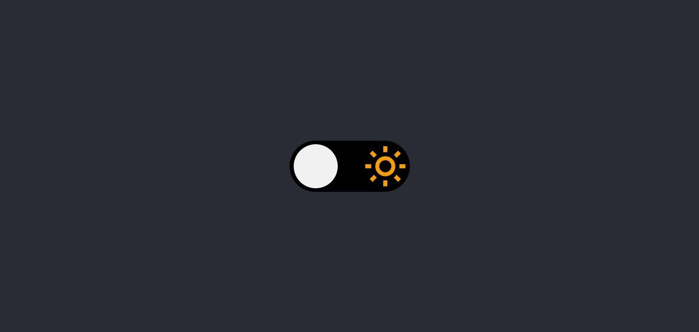

# Theme Switcher 

Nesse desafio foi desenvolvido uma página que contem um toggle para alternar entre o tema dark e light.

[🔗 Clique aqui para acessar](https://gabrielli-lima.github.io/ThemeSwitcher/)

## 🛠️ Tecnologias

- HTML
- CSS
- JavaScript